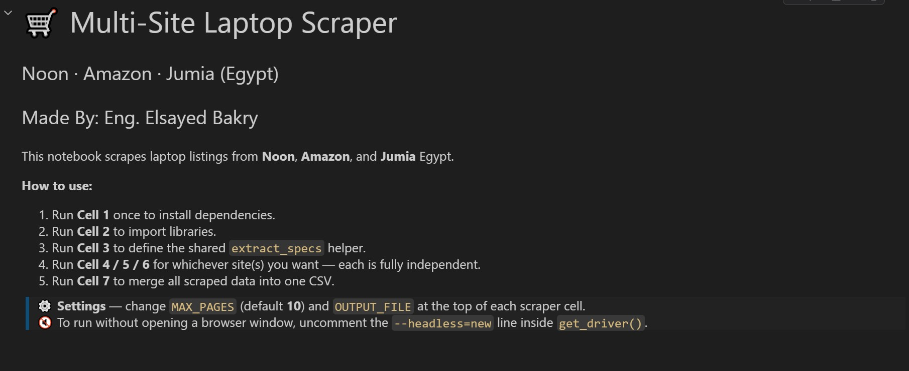
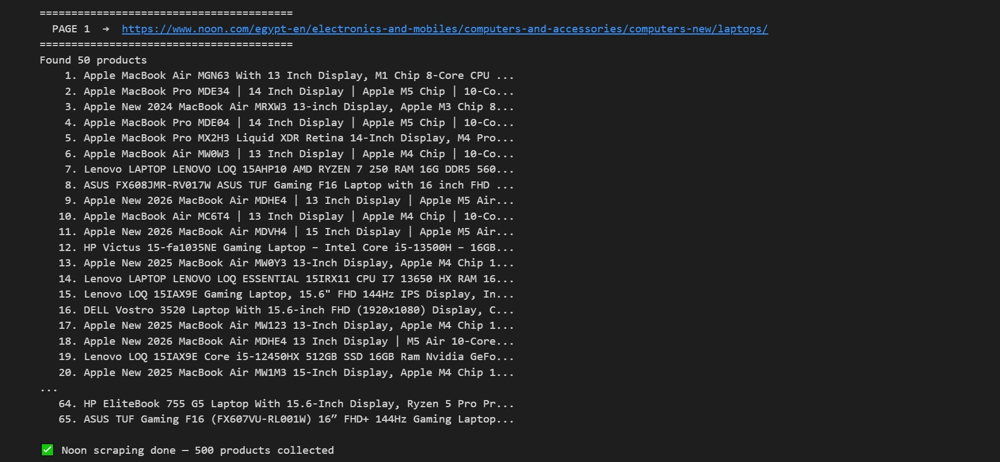
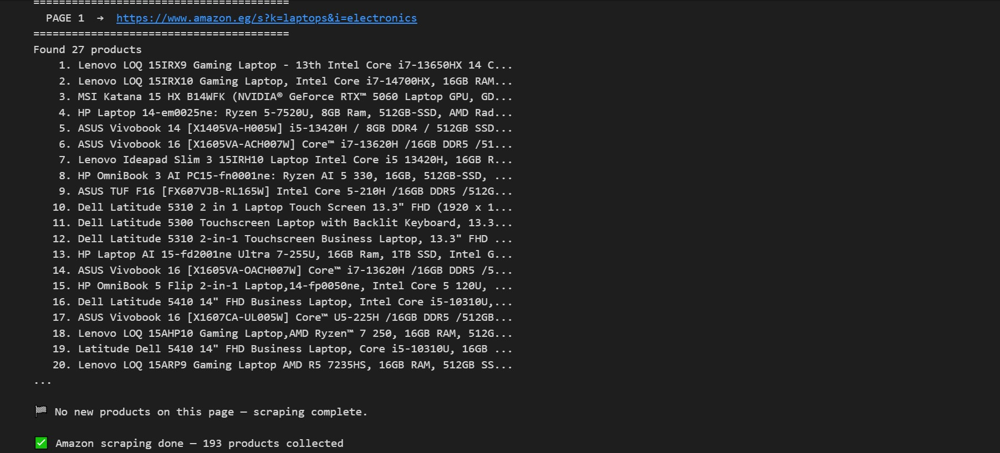
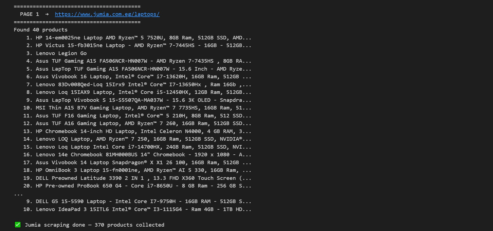
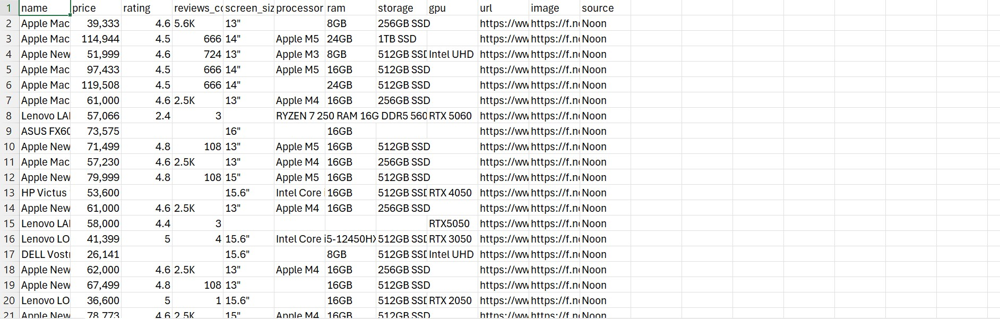
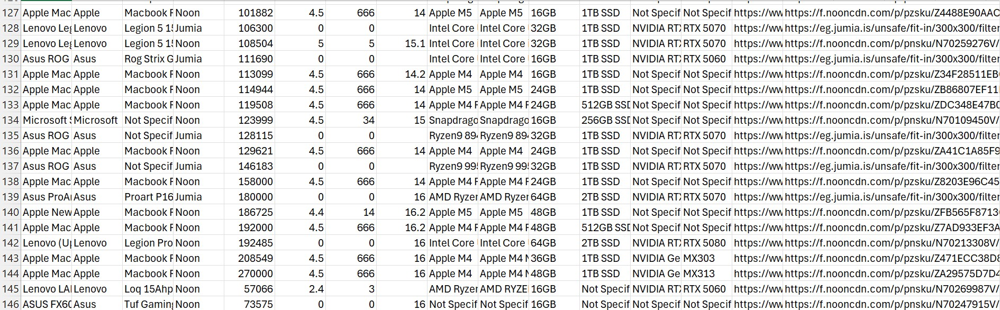

# 🛒 Egypt Multi-Site Laptop Price Scraper & Cleaner

> **Scrape → Clean → Analyze** | A complete data pipeline for laptop prices across Egypt's top e-commerce platforms.

[](https://python.org)
[](https://selenium.dev)
[](https://pandas.pydata.org)
[]()
[]()

---

## 📌 What This Project Does

This project automatically collects laptop listings from **three major Egyptian e-commerce websites**, merges them into a single raw dataset, then runs them through a **13-stage data cleaning pipeline** to produce a clean, analysis-ready CSV.

| Stage | What Happens |
|-------|-------------|
| 🕷️ **Scraping** | Selenium scrapes Noon, Amazon & Jumia Egypt |
| 🧹 **Cleaning** | 13-stage Python pipeline fixes prices, specs & duplicates |
| 📦 **Output** | Clean dataset ready for analysis, dashboards, or ML |


---

## 📊 Dataset Snapshot

After cleaning, the dataset contains **752 unique laptop listings** (down from 1,063 raw):

| Metric | Value |
|--------|-------|
| 🏪 Total unique listings | 752 |
| 🌐 Sources | Noon (351) · Jumia (280) · Amazon (121) |
| 💰 Price range | 47 EGP → 270,000 EGP |
| 💰 Median price | ~44,000 EGP |
| 🏷️ Top brands | Lenovo, Asus, HP, Dell, Apple, MSI |
| 🖥️ Columns | 16 (name, brand, price, processor, RAM, storage, GPU, rating, URL, image …) |

---

## 🗂️ Project Structure

```
📦 laptop-scraper/
├── 📓 multi_site_laptop_scraper.ipynb   ← Main scraper notebook (Noon + Amazon + Jumia)
├── 🧹 cleaning_data.py                  ← 13-stage data cleaning pipeline
├── 📄 requirements.txt                  ← Python dependencies
├── 📊 all_laptops.csv                   ← Raw scraped data (1,063 rows)
└── ✅ final_ready_laptops.csv           ← Clean, deduplicated output (752 rows)
```

---

## ⚙️ How It Works

### Phase 1 — Scraping (`multi_site_laptop_scraper.ipynb`)

The notebook scrapes three sites using **Selenium + Chrome** with anti-bot evasion techniques.

```
┌──────────────────────────────────────────────────────────┐
│                    SCRAPING PIPELINE                      │
│                                                          │
│  ┌─────────┐    ┌──────────┐    ┌─────────┐             │
│  │  Noon   │    │  Amazon  │    │  Jumia  │             │
│  │ Egypt   │    │  Egypt   │    │  Egypt  │             │
│  └────┬────┘    └────┬─────┘    └────┬────┘             │
│       │              │               │                   │
│       └──────────────┴───────────────┘                   │
│                       │                                  │
│              ┌─────────▼──────────┐                      │
│              │  extract_specs()   │                      │
│              │  (regex from name) │                      │
│              └─────────┬──────────┘                      │
│                        │                                 │
│              ┌─────────▼──────────┐                      │
│              │   all_laptops.csv  │                      │
│              │   (1,063 rows)     │                      │
│              └────────────────────┘                      │
└──────────────────────────────────────────────────────────┘
```
**Noon scraping output:**


**Amazon scraping output:**


**Jumia scraping output:**



Each scraper cell:
- Navigates pages automatically (URL pagination)
- Waits for products to load dynamically
- Extracts: `name`, `price`, `rating`, `reviews_count`, `image`, `url`
- Parses hardware specs from the title via regex
- Deduplicates within each site using a seen-titles guard

### Phase 2 — Cleaning (`cleaning_data.py`)

A production-grade 13-stage pipeline transforms the raw data:

```
all_laptops.csv (1,063 rows)
         │
         ▼
┌─────────────────────────────────────────────────────────┐
│  Stage  1  │  Load & audit — print missing value report  │
│  Stage  2  │  Drop rows missing name or price            │
│  Stage  3  │  Fill rating/reviews with 0 (Jumia has none)│
│  Stage  4  │  Clean price → clean float EGP              │
│  Stage  5  │  Clean screen_size → float inches (10–21)   │
│  Stage  6  │  Fix RAM/Storage cross-bleed errors         │
│  Stage  7  │  Regex-fill missing specs from product name │
│  Stage  8  │  Standardise processor → canonical family   │
│  Stage  9  │  Standardise GPU → canonical family         │
│  Stage 10  │  Fill remaining NaN → "Not Specified"        │
│  Stage 11  │  Cross-site deduplication (keep lowest price)│
│  Stage 12  │  Final column ordering & type enforcement    │
│  Stage 13  │  Save UTF-8 BOM CSV (Excel-compatible)      │
└─────────────────────────────────────────────────────────┘
         │
         ▼
final_ready_laptops.csv (752 rows, 16 columns)
```
**Raw data (before cleaning):**


**Clean data (after cleaning):**



**Notable cleaning challenges handled:**
- 💱 Prices with Arabic commas and currency symbols
- 🔁 RAM/Storage values swapped in the wrong column (e.g., `512GB` appearing as RAM)
- 📏 Screen sizes like `313"` from model numbers fused with dimensions
- 🔤 50+ processor/GPU naming variations standardised to canonical families
- 🔗 Same laptop listed on multiple sites → kept only the cheapest

---

## 🚀 Getting Started

### 1. Clone the repository

```bash
git clone https://github.com/YOUR_USERNAME/laptop-scraper-egypt.git
cd laptop-scraper-egypt
```

### 2. Install dependencies

```bash
pip install -r requirements.txt
```

**Requirements:**
```
pandas
selenium
undetected-chromedriver
beautifulsoup4
jupyter
```

> ℹ️ You also need **Google Chrome** installed. `webdriver-manager` handles the ChromeDriver automatically.

### 3. Run the scraper

Open the notebook in Jupyter:

```bash
jupyter notebook multi_site_laptop_scraper.ipynb
```

Run cells in order:
- **Cell 1** — Install dependencies (run once)
- **Cell 2** — Imports
- **Cell 3** — Shared helpers (`get_driver`, `extract_specs`)
- **Cell 4** — Scrape Noon Egypt
- **Cell 5** — Scrape Amazon Egypt
- **Cell 6** — Scrape Jumia Egypt
- **Cell 7** — Merge all sources → `all_laptops.csv`

> **Tip:** Set `MAX_PAGES = 5` for a quick test run. Set to `None` to scrape everything.  
> **Tip:** Uncomment `--headless=new` inside `get_driver()` to run without a browser window.

### 4. Run the cleaning pipeline

```bash
python cleaning_data.py
```

Output: `final_ready_laptops.csv` — clean, deduplicated, analysis-ready.

---

## 📋 Output Columns

| Column | Type | Description |
|--------|------|-------------|
| `name` | str | Full product title |
| `brand` | str | Brand (Lenovo, HP, Dell…) |
| `model_name` | str | Model extracted from name |
| `source` | str | Noon / Amazon / Jumia |
| `price` | float | Price in EGP |
| `rating` | float | Star rating (0–5) |
| `reviews_count` | int | Number of reviews |
| `screen_size` | float | Screen size in inches |
| `processor` | str | Canonical family (e.g. "Intel Core i7") |
| `processor_detail` | str | Full processor string |
| `ram` | str | e.g. "16GB" |
| `storage` | str | e.g. "512GB SSD" |
| `gpu` | str | Canonical GPU family |
| `gpu_detail` | str | Full GPU string |
| `url` | str | Product page URL |
| `image` | str | Product image URL |

---

## 🛡️ Anti-Bot Measures Used

The scraper uses several techniques to avoid detection:

- Masks `navigator.webdriver` flag via Chrome DevTools Protocol
- Disables automation extension flags
- Adds realistic scroll delays between page loads
- Seen-titles guard to stop when pagination loops

---

## 📝 Notes

- Prices are in **Egyptian Pounds (EGP)**
- Jumia listings have no rating/review data — filled with `0`
- Cross-site duplicates are resolved by keeping the **lowest price** listing
- The `processor` and `gpu` columns use **canonical family names** for easy filtering; the original strings are preserved in `processor_detail` / `gpu_detail`

---

## 👤 Author

**Eng. Elsayed Ashraf Bakry**

---

## ⚠️ Disclaimer

This project is for educational and research purposes. Always check a website's Terms of Service before scraping. Use responsibly.
